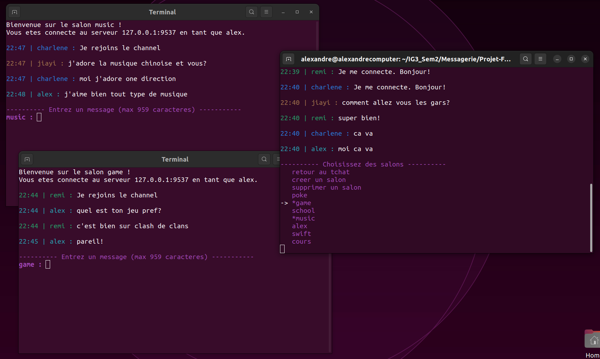

<div align="center">

# Application de messagerie en C

<a rel="license" href="http://creativecommons.org/licenses/by-nc-sa/4.0/"></a><br />Ce travail est sous licence <a rel="license" href="http://creativecommons.org/licenses/by-nc-sa/4.0/">Creative Commons Attribution - Pas d'Utilisation Commerciale - Partage dans les Mêmes Conditions 4.0 International</a>.

---

Version anglaise de ce document : [README.md](README.md)
<a href="README.md"></a>

---

### **Description**

Il s'agit d'un serveur et d'un client multithreadés pour une application de messagerie ILC écrite en C. Plusieurs clients peuvent se connecter au serveur et s'envoyer des messages, échanger des fichiers, gérer des salons de discussion, et bien plus encore. Les différents répertoires font référence à chaque session que nous avons consacrée à travailler sur le projet. Le premier est la première session, le deuxième est la deuxième session, et ainsi de suite. À chaque session, nous avons ajouté de nouvelles fonctionnalités à notre projet. La version finale est celle de la dernière session.

---

[Installation et Exécution](#installation) •
[Documentation](#documentation) •
[Contributions](#contributions)

**Veuillez lire attentivement la [Documentation](Documentation.pdf) fournie ainsi que le [Manuel Utilisateur](Guide_Utilisation.pdf).**
</div>


## Fonctionnalités

- Les utilisateurs peuvent s'envoyer des messages en temps réel.
- Les utilisateurs peuvent télécharger des fichiers depuis le serveur.
- Les utilisateurs peuvent téléverser des fichiers vers le serveur.
- Les utilisateurs peuvent créer, rejoindre, supprimer et quitter plusieurs salons en même temps.

Tout est réalisé de manière sécurisée, en temps réel et en parallèle grâce au multithreading.

## Table des matières

- [Installation](#installation)
  - [Prérequis](#prérequis)
  - [Compilation](#compilation)
  - [Exécution](#exécution)
  - [Commandes](#commandes)
- [Documentation](#documentation)
- [Captures d'écran](#captures-décran)
- [Structure du projet](#structure-du-projet)
- [Contributions](#contributions)
  - [Auteurs](#auteurs)
  - [Contrôle des versions](#contrôle-des-versions)
  - [Historique](#historique)

# Installation
<sup>[(Retour en haut)](#table-des-matières)</sup>

Cette section explique comment installer et exécuter la dernière version du projet.

## Prérequis
<sup>[(Retour en haut)](#table-des-matières)</sup>


Vous devez avoir gcc installé sur votre machine.

## Compilation
<sup>[(Retour en haut)](#table-des-matières)</sup>

Tout d'abord, vous devez cloner le dépôt :

```bash
git clone <repo_url>
```

Ouvrez un terminal et accédez au répertoire de la dernière version du projet contenant le fichier bash "compil.sh". Assurez-vous d'être dans le bon répertoire.

Pour compiler le projet, exécutez le script bash à l'aide de la commande :

```bash
./compil.sh
``` 
Ce script créera un répertoire appelé "bin" dans le répertoire courant. Ce répertoire sera utilisé pour stocker les fichiers binaires générés.

## Exécution
<sup>[(Retour en haut)](#table-des-matières)</sup>

Déplacez-vous dans le nouveau répertoire "bin" en utilisant la commande :
```bash
cd bin
``` 
Assurez-vous d'être maintenant dans ce répertoire.

À l'intérieur du répertoire "bin", vous trouverez deux fichiers binaires compilés : "client" et "server". Ces fichiers seront utilisés respectivement pour lancer le client et le serveur du programme.

Tout d'abord, exécutez le serveur en spécifiant le port sur lequel vous souhaitez qu'il écoute les connexions. Utilisez la commande :
```bash
./server <port>
``` 
(par exemple, `./server 3000`)

Cela lancera le serveur et il sera prêt à accepter les connexions des clients.

Ensuite, pour chaque client que vous souhaitez exécuter, ouvrez un nouveau terminal et déplacez-vous dans le répertoire "bin" comme précédemment. Utilisez la commande :
```bash
./client <server_ip> <server_port>
``` 
pour lancer un client et vous connecter au serveur. Remplacez "<server_ip>" par l'adresse IP du serveur et "<server_port>" par le port sur lequel le serveur écoute.

(par exemple, `./client 162.111.186.34 3000`).

Répétez les dernières étapes pour chaque client que vous souhaitez exécuter, en ouvrant un nouveau terminal pour chaque client.

Assurez-vous de lancer le serveur et chaque client dans des terminaux séparés.

Une fois que vous avez démarré le serveur et les clients, vous êtes prêt à commencer à discuter sur la plateforme de messagerie. Chaque client aura son propre interface pour envoyer et recevoir des messages.

En suivant ces étapes, vous pourrez compiler, exécuter et interagir avec le programme de messagerie en utilisant le serveur et les clients fournis.

## Commandes
<sup>[(Retour en haut)](#table-des-matières)</sup>

Voici la liste des commandes disponibles pour les utilisateurs :

- `@pseudo message`: Mentionne une personne spécifique sur le serveur et affiche le message en évidence.
- `@everyone message`: Mentionne toutes les personnes actuellement sur le serveur.
- `/fin`: Permet de mettre fin au protocole de communication et fermer le programme.
- `/mp <pseudo> <message>`: Envoie un message privé à la personne mentionnée par le pseudo.
- `/man`: Affiche le guide d'utilisation.
- `/list`: Affiche tous les utilisateurs connectés.
- `/who`: Renvoie le pseudo.
- `/upload <fichier>`: Télécharge le fichier qui se trouve dans le répertoire de client_files vers le serveur.
- `/upload`: Ouvre le menu de sélection de fichier afin d'envoyer un fichier de client_files vers le serveur.
- `/download`: Ouvre le menu de sélection de fichier afin de télécharger le fichier choisi depuis le serveur.
- `/salon`: Ouvre le menu des salons pour pouvoir créer, rejoindre, quitter et supprimer des salons.
- `/exit`: Commande à taper dans un salon. Permet de quitter le salon. La fenêtre du salon se fermera automatiquement.

# Documentation
<sup>[(Retour en haut)](#table-des-matières)</sup>

Une documentation complète est fournie dans le fichier [Documentation](Documentation.pdf).

Un manuel utilisateur est également fourni dans le fichier [Manuel Utilisateur](Guide_Utilisation.pdf).

# Captures d'écran
<sup>[(Retour en haut)](#table-des-matières)</sup>

Un utilisateur avec plusieurs salons ouverts :


Un utilisateur téléchargeant un fichier depuis le serveur :


# Structure du projet
<sup>[(Retour en haut)](#table-des-matières)</sup>

Voici la structure du projet :

```bash
.
├── bin
│   ├── client
│   ├── client_salon
│   └── server
├── compil.sh
└── src
    ├── client.c
    ├── client_files
    │   ├── alex.txt
    │   ├── document.txt
    │   ├── elgreco.jpg
    │   ├── image.jpg
    │   ├── linux.png
    │   ├── Nature_.jpg
    │   └── nyan.gif
    ├── client_salon.c
    ├── manuel.txt
    ├── server.c
    ├── server_channels
    │   ├── alex
    │   ├── cours
    │   ├── game
    │   ├── music
    │   ├── poke
    │   ├── school
    │   └── swift
    └── server_files
        ├── alex.txt
        ├── document.txt
        ├── elgreco.jpg
        ├── image.jpg
        ├── linux.png
        ├── Nature_.jpg
        └── nyan.gif
```

# Contributions
<sup>[(Retour en haut)](#table-des-matières)</sup>

## Auteurs
<sup>[(Retour en haut)](#table-des-matières)</sup>

- [**Alexandre Deloire**](https://github.com/alexdeloire)
- [**Remi Jorge**](https://github.com/RemiJorge)

## Contrôle des versions
<sup>[(Retour en haut)](#table-des-matières)</sup>

Git est utilisé pour le contrôle des versions. Le projet a été réalisé en itérations de sprint, avec une nouvelle version du projet publiée à la fin de chaque sprint.

## Historique
<sup>[(Retour en haut)](#table-des-matières)</sup>

Les différentes itérations de sprint du projet sont disponibles dans ce [dépôt](https://github.com/RemiJorge/Projet-FAR).