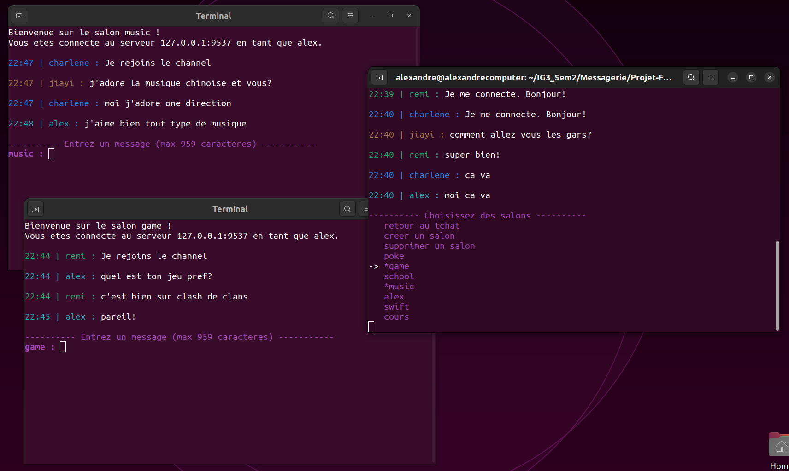
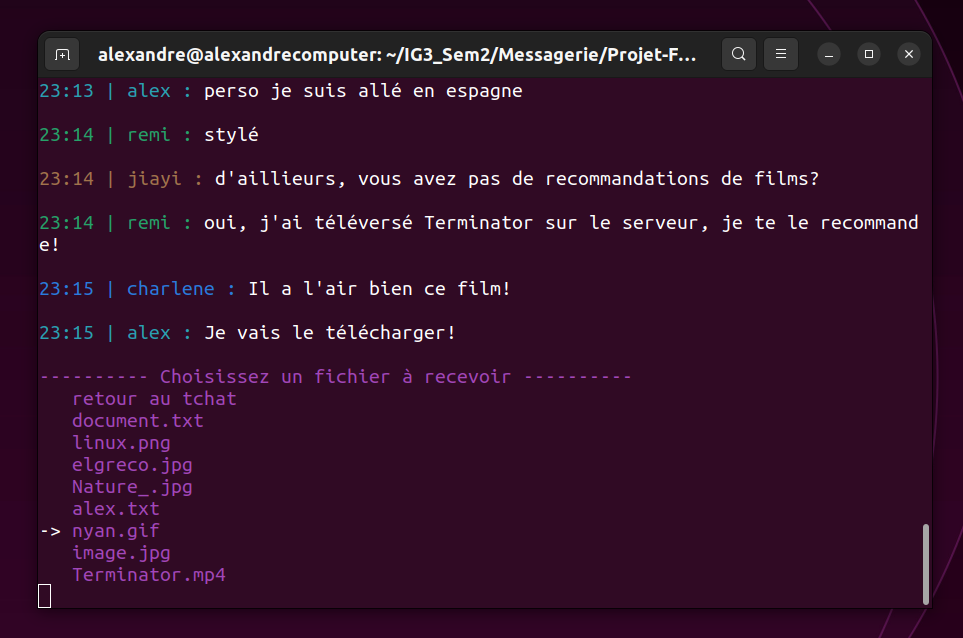

<div align="center">

# Messaging App in C

<a rel="license" href="http://creativecommons.org/licenses/by-nc-sa/4.0/"></a><br />This work is licensed under a <a rel="license" href="http://creativecommons.org/licenses/by-nc-sa/4.0/">Creative Commons Attribution-NonCommercial-ShareAlike 4.0 International License</a>.

---

French version of this : [README.fr.md](README.fr.md)
<a href="README.fr.md"></a>

---

### **Description**

This is a multithreaded CLI server and client for a messaging app written in C. Multiple clients can connect to the server and send messages to each other, exchange files, manage messaging channels, and more. The different directories refer to each session we spent working on the project. The first one is the first session, the second one is the second session and so on. In each session, we added new features to our project. The final version is the one in the last session.

---

[Installation and Execution](#installation) •
[Documentation](#documentation) •
[Contributions](#contributions)

**Please read the the thourough [Documentation](Documentation.pdf) provided and the [User Manual](Guide_Utilisation.pdf).**
</div>


## Features

- Users can send messages to each other in real time
- Users can download files from the server
- Users can upload files to the server
- Users can create, join, delete, and leave multiple channels at the same time

Everything is done securely, in real time, and in parallel thanks to multithreading.

## Table of Contents

- [Installation](#installation)
  - [Pre-requisites](#pre-requisites)
  - [Compilation](#compilation)
  - [Execution](#execution)
  - [Commands](#commands)
- [Documentation](#documentation)
- [Demo Screenshots](#demo-screenshots)
- [Folder structure](#folder-structure)
- [Contributions](#contributions)
  - [Authors](#authors)
  - [Version control](#version-control)
  - [History](#history)

# Installation
<sup>[(Back to top)](#table-of-contents)</sup>

This section will guide you through the installation and execution of the latest version of the project.

## Pre-requisites
<sup>[(Back to top)](#table-of-contents)</sup>


You need to have gcc installed on your machine.

## Compilation
<sup>[(Back to top)](#table-of-contents)</sup>

First you need to clone the repository:

```bash
git clone <repo_url>
```


Open a terminal and navigate to the directory of the latest version of the project containing the "compil.sh" bash file. Make sure you are in the correct directory.

To compile the project, execute the bash script using the command: 

```bash
./compil.sh
``` 
This script will create a directory called "bin" in the current directory. This directory will be used to store the generated binary files.

## Execution
<sup>[(Back to top)](#table-of-contents)</sup>

Navigate to the newly created "bin" directory using the command:
```bash
cd bin
``` 
Make sure you are now inside this directory.

Inside the "bin" directory, you will find two compiled binary files: "client" and "server". These files will be used to respectively launch the client and server of the program.

First, run the server by specifying the port on which you want it to listen for connections. Use the command:
```bash
./server <port>
``` 
(e.g., `./server 3000`)

This will start the server, and it will be ready to accept client connections.

Next, for each client you want to run, open a new terminal and navigate to the "bin" directory as before. Use the command: 
```bash
./client <server_ip> <server_port>
``` 
to launch a client and connect it to the server. Replace `<server_ip>` with the IP address of the server and `<server_port>` with the port on which the server is listening. 

(e.g., `./client 162.111.186.34 3000`).

Repeat the last steps for each client you want to run, opening a new terminal for each client.

Make sure to run the server and each client in separate terminals.

Once you have started the server and clients, you are ready to begin chatting on the messaging platform. Each client will have its own interface for sending and receiving messages.

By following these steps, you will be able to compile, run, and interact with the messaging program using the provided server and clients.

## Commands
<sup>[(Back to top)](#table-of-contents)</sup>

The following commands are available to the user:
Here is the list of available commands for users:

- `@username <message>`: Mentions a specific person on the server and highlights the message.
- `@everyone <message>`: Mentions everyone currently on the server.
- `/fin`: Ends the communication protocol and closes the program.
- `/mp <username> <message>`: Sends a private message to the person mentioned by the username.
- `/man`: Displays the user guide.
- `/list`: Displays all connected users.
- `/who`: Returns the username.
- `/upload <file>`: Uploads the file located in the client_files directory to the server.
- `/upload`: Opens the file selection menu to send a file from client_files to the server.
- `/download`: Opens the file selection menu to download the chosen file from the server.
- `/salon`: Opens the channel menu to create, join, leave, and delete channels.
- `/exit`: Command to type in a channel. Allows leaving the channel. The channel window will close automatically.

# Documentation
<sup>[(Back to top)](#table-of-contents)</sup>

A thourough documentation is provided in the [Documentation](Documentation.pdf) file.

A User Manual is also provided in the [User Manual](Guide_Utilisation.pdf) file.

# Demo Screenshots
<sup>[(Back to top)](#table-of-contents)</sup>

A user with multiple channels open:


A user downloading a file from the server:


# Folder structure
<sup>[(Back to top)](#table-of-contents)</sup>

The project is structured as follows:
```bash
.
├── bin
│   ├── client
│   ├── client_salon
│   └── server
├── compil.sh
└── src
    ├── client.c
    ├── client_files
    │   ├── alex.txt
    │   ├── document.txt
    │   ├── elgreco.jpg
    │   ├── image.jpg
    │   ├── linux.png
    │   ├── Nature_.jpg
    │   └── nyan.gif
    ├── client_salon.c
    ├── manuel.txt
    ├── server.c
    ├── server_channels
    │   ├── alex
    │   ├── cours
    │   ├── game
    │   ├── music
    │   ├── poke
    │   ├── school
    │   └── swift
    └── server_files
        ├── alex.txt
        ├── document.txt
        ├── elgreco.jpg
        ├── image.jpg
        ├── linux.png
        ├── Nature_.jpg
        └── nyan.gif
```

# Contributions
<sup>[(Back to top)](#table-of-contents)</sup>

## Authors
<sup>[(Back to top)](#table-of-contents)</sup>

- [**Alexandre Deloire**](https://github.com/alexdeloire)
- [**Remi Jorge**](https://github.com/RemiJorge)

## Version control
<sup>[(Back to top)](#table-of-contents)</sup>

Git is used for version control. The project was done in sprint iterations, with a new version of the project being released at the end of each sprint.

## History
<sup>[(Back to top)](#table-of-contents)</sup>

The different sprint iterations of the project are available in this [repository](https://github.com/RemiJorge/Projet-FAR).
